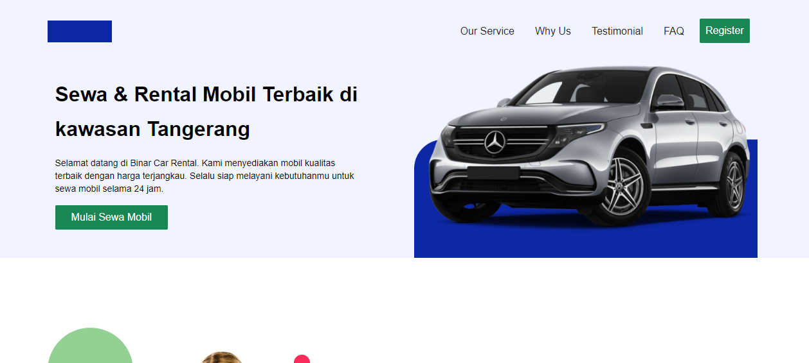

# Binar Car Rental

Welcome to Binar Car Rental, your one-stop destination for hassle-free car rentals. Explore our modern and user-friendly car rental website, designed to make your car rental experience smooth and convenient.

## Table of Contents
- [Overview](#binar-car-rental)
- [Features](#features)
- [Tech Stack](#tech-stack)
- [Getting Started](#getting-started)
- [Usage](#usage)
- [Contributing](#contributing)
- [Credits](#credits)

## Features
- **Navbar**: Easy navigation with a responsive navbar.
- **Why Us**: Discover why Binar Car Rental is the best choice for your car rental needs.
- **Testimonial**: Hear what our satisfied customers have to say about us.
- **Banner**: Engaging banner section to showcase our services.
- **FAQ Carousel**: An interactive carousel to answer common questions.
- **Footer**: Connect with us and access important links.

## Tech Stack
- HTML
- CSS
- JavaScript
- Bootstrap 5

## Getting Started
To get started with Binar Car Rental, simply visit our website [here](#insert-website-link). You can explore our services, view testimonials, and rent your dream car with ease.

## Usage
1. Visit the [Binar Car Rental Website](car-rental-binar-yulius.netlify.app).
2. Navigate through the different sections of the website using the responsive navbar.
3. Learn more about our services in the "Why Us" section.
4. Read testimonials from our happy customers.
5. Explore our car offerings through the engaging banner.
6. Have questions? Check out our FAQ section.
7. Contact us through the footer.

## Contributing
We welcome contributions to improve Binar Car Rental. If you have ideas, feature requests, or bug reports, please open an issue or create a pull request.

## Credits
This project is developed as a part of the Binar Bootcamp.

